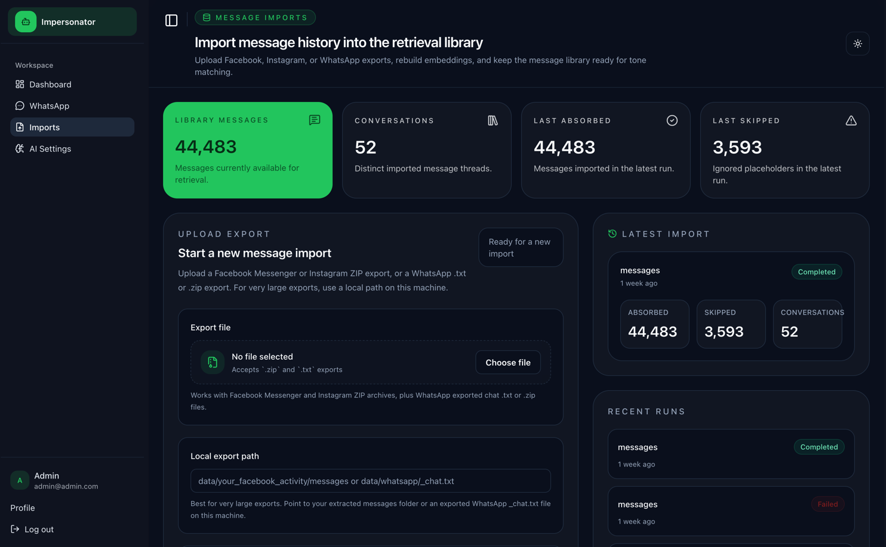
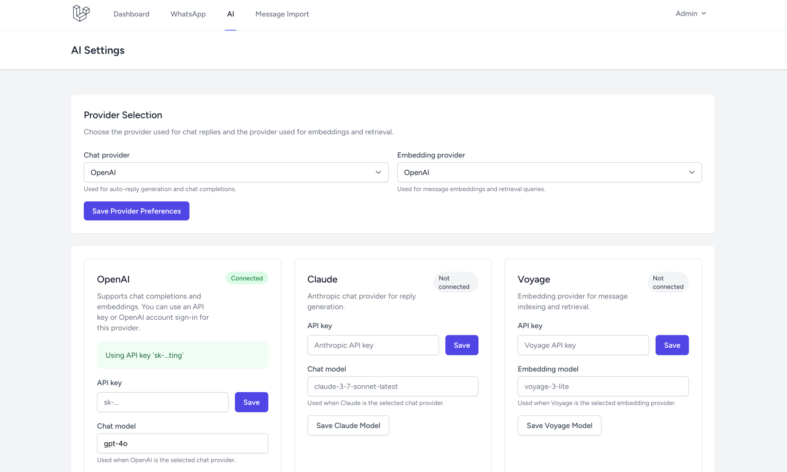
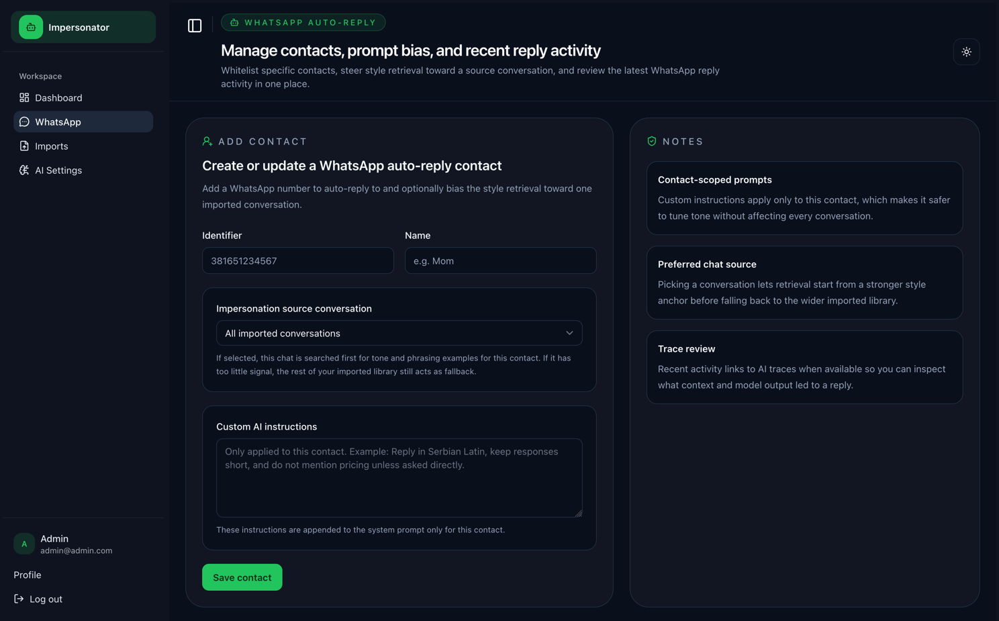
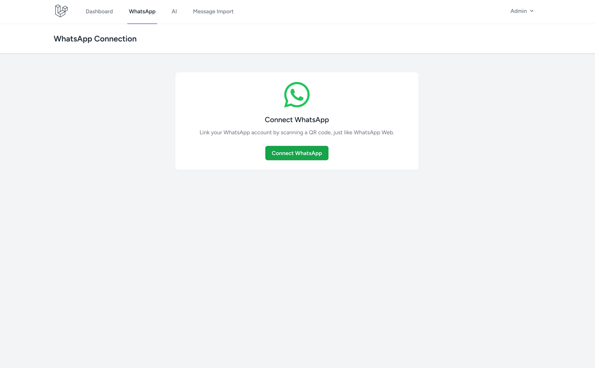

# Impersonator

An experimental Laravel application for AI-assisted WhatsApp replies built from your own historical message data.

> [!WARNING]
> This project is research-only software.
> It is inspired by the "Be Right Back" episode of *Black Mirror*, but it is not intended for deception, identity fraud, or covert impersonation.
> Do not use it to mislead people, bypass consent, or automate conversations in harmful or manipulative ways.

Impersonator explores a simple question: what happens when retrieval over personal message history, prompt construction, and WhatsApp automation are combined into one research pipeline?

It imports message archives, builds embeddings, retrieves relevant prior messages, and uses an LLM to draft or send WhatsApp-style replies through WAHA. The app also stores traces so you can inspect the context, prompt, and output behind each reply.

## Core Features

- WhatsApp session management through [WAHA](https://waha.devlike.pro/) with QR-based device linking
- Public webhook ingestion for incoming WhatsApp events
- Database-backed queued auto-reply processing
- Import support for Facebook Messenger, Instagram, and WhatsApp exports
- Embedding generation and semantic retrieval with PostgreSQL + `pgvector`
- Configurable AI providers for chat and embeddings
- Per-contact auto-reply allowlist with optional custom instructions
- Per-contact preferred source conversation to bias style retrieval
- AI trace inspection showing recent context, retrieved hits, final prompt, latency, and usage
- Authenticated operator UI built with Laravel Breeze, Blade, Alpine.js, Tailwind CSS, and Vite

## Tech Stack

- PHP 8.3
- Laravel 13
- PostgreSQL with `pgvector`
- Blade, Alpine.js, Tailwind CSS, Vite
- Laravel Breeze
- WAHA for WhatsApp connectivity and sending
- OpenAI and Anthropic for chat generation
- OpenAI and Voyage AI for embeddings
- Database-backed queues

## Supported Data Sources

- Facebook Messenger JSON exports
- Instagram JSON exports
- WhatsApp single-chat exports as `.txt` or `.zip`

More details live in [docs/message-imports.md](docs/message-imports.md).

## Quick Start

```bash
composer run setup
./vendor/bin/sail up -d
composer run dev
```

Then open the app and use:

- `/whatsapp` to connect a WhatsApp session
- `/ai` to configure chat providers, embedding providers, credentials, and model choices
- `/imports/messages` to import historical data
- `/whatsapp/auto-reply` to choose which contacts are allowed to receive automated replies

The default local flow uses Docker and Laravel Sail. AI credentials and provider choices are configured from the app UI rather than directly in `.env`.

## Security, Privacy, and Ethics

This project handles sensitive personal message history.

- Do not commit exports, credentials, or private conversation data.
- Do not log raw secrets or unnecessary personal content.
- Treat webhook routes as public entrypoints and keep them carefully scoped.
- Be especially cautious when experimenting with automated replies that simulate a person's style or tone.

If you share demos publicly, use scrubbed or synthetic data.

## Screenshots

### Message import and retrieval library



### AI provider configuration



### Contact-level auto-reply controls



### WhatsApp connection flow



## Contributing

Small, focused changes are best. Preserve the existing webhook, queue, and message-processing pipeline, and update docs when setup or operator-facing behavior changes.

## License

MIT
